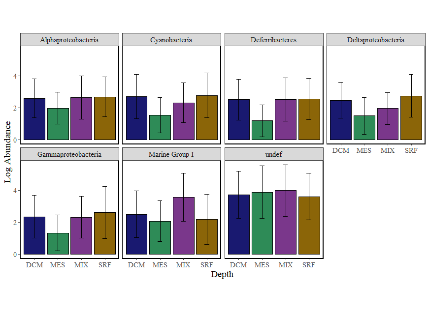

# Abundance Barplot

## Quick Start

  - Open rstudio in binder and press knit.
  - 
## Example Output

   - 

## Summary
  - You can explore differences amongst taxa in metabarcoding data in several different ways. This file will help you determine differences amongst categories in the most abundant taxa in your dataset.
Outputs include:
  1. A group of barplots of the log abundance of the top 20 taxa in the chosen taxonomic category
  2. An ANOVA with post-hoc Tukey test

Inputs:
1. otu table
2. taxa table
3. mapping file

OR
1. phyloseq file

 
## Authors

 - Author Name, github id (and ORCID if you have it)

## Links

Zenodo Binder, doi: LINK_TO_BINDER

Github Binder: LINK_TO_BINDER

Github Repository: https://github.com/speeding-up-science-workshops/<REPO_NAME>

